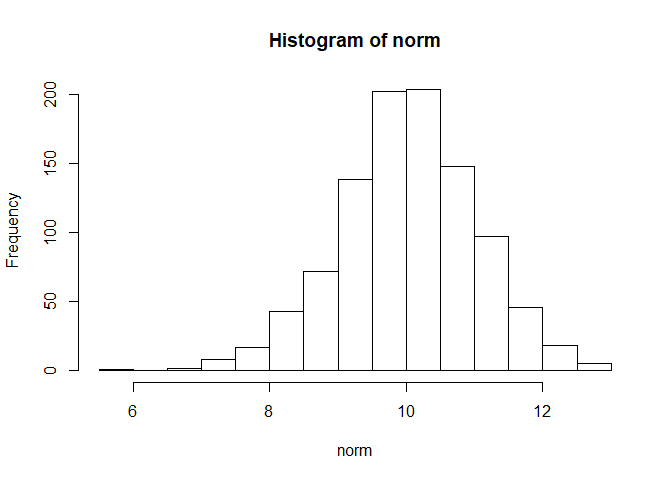
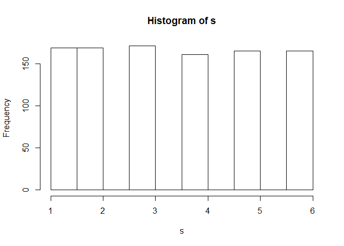
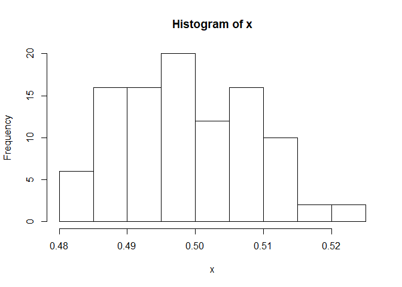
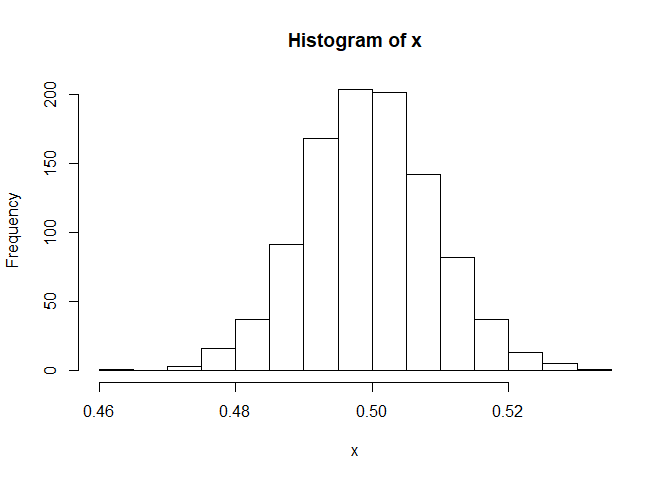
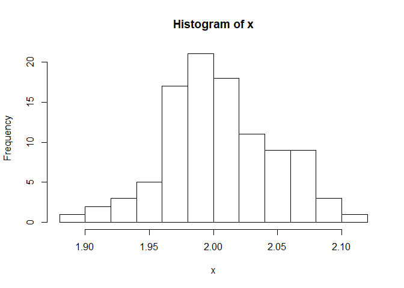
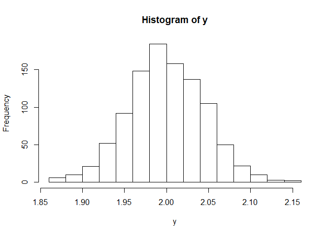
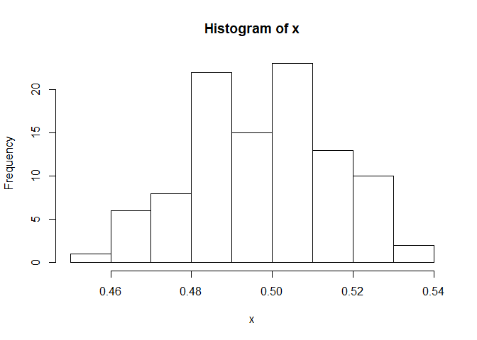
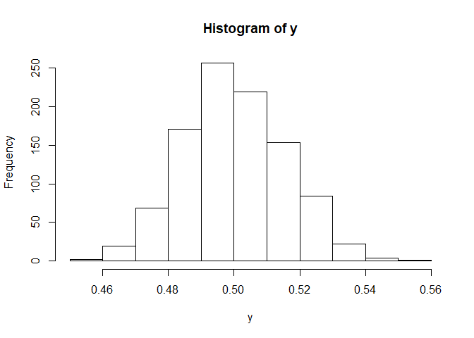

Assignment 1
================
Kyle Walker
9/18/2019

## Part I - R Basics

### 1\. Calculate the following sums:

``` r
#S1
x <- c(1:2019)
sum(x)
```

    ## [1] 2039190

``` r
#S2
sum(x^3)
```

    ## [1] 4.158296e+12

``` r
#S3
sum(x^x)
```

    ## [1] Inf

``` r
s4 <- (c(1,-1)* x)

#S4
sum(s4^x)
```

    ## [1] Inf

``` r
#S5
sum(1/(x^2))
```

    ## [1] 1.644439

``` r
#S6
sum(1/x)
```

    ## [1] 8.187821

``` r
#S7
sum(1/(x^3))
```

    ## [1] 1.202057

``` r
#S8
sum(1/(s4))
```

    ## [1] 0.6933948

### 2\. The rnorm function generate random variables from normal distribution. Generate a sample of 1000 values from normal distribution with the mean 10 and standard deviation 1.

#### a. Calculate the mean and standard deviation of the sample.

``` r
norm <- rnorm(1000, 10, 1)
mean(norm)
```

    ## [1] 10.0252

``` r
sd(norm)
```

    ## [1] 1.008425

#### b. Out of 1000 samples, how many do you think are that great than 10? Check your estimation.

``` r
#Should expect 500
sum(norm > 10)
```

    ## [1] 517

#### c. Use hist() function to show the histogram of the sample.

``` r
hist(norm)
```

<!-- -->

#### d. Estimate P(X \> 1), where X ∼ N(2, 1)

``` r
prob <- rnorm(1000, 2, 1)
#Probability that X > 1:
sum(prob > 1) / 1000
```

    ## [1] 0.83

### 3\. Consider an experiment of tossing a fair dice.

#### a. Use the sample (with replacement) function to generate a sample of 1000 values from the experiment.

``` r
x <- c(1:6)
s <- sample(x, 1000, replace = TRUE)
```

#### b. Calculate the mean and standard deviation of the sample.

``` r
mean(s)
```

    ## [1] 3.479

``` r
sd(s)
```

    ## [1] 1.710112

#### c. How many times the 6 occured?

``` r
sum(s == 6)
```

    ## [1] 165

#### d. Use table function to show the frequency of the values.

``` r
table(s)
```

    ## s
    ##   1   2   3   4   5   6 
    ## 169 169 171 161 165 165

#### e. Use prop.table(table()) to show the relative frequency of the values.

``` r
prop.table(table(s))
```

    ## s
    ##     1     2     3     4     5     6 
    ## 0.169 0.169 0.171 0.161 0.165 0.165

#### f. Plot the frequency of the values.

``` r
hist(s)
```

<!-- -->

### 4\. Consider an experiment of tossing a dice 3 times. Let X1, X2, and X3 be the number of tossing the first time, second time and third time, respectively. Use simulation to estimate the following probabilities:

#### a. P(X1 \> X2 + X3)

``` r
exper <- matrix(data=(sample(x, 3000, replace = TRUE)), nrow = 1000, ncol = 3)
sum(exper[,1] > (exper[,2] + exper[,3])) / 1000
```

    ## [1] 0.085

#### b. P(X1^2 \> X2^2 + X3^2)

``` r
sum(exper[,1]^2 > (exper[,2]^2 + exper[,3]^2)) / 1000
```

    ## [1] 0.221

### 5\. Using simulation, estimate the probability of getting three tails in a row when tossing a coin 3 times.

#### Hint: one way is to generate a matrix with three columns where each rows is an observation of tossing a coin three times.

``` r
# 1 is a head in this case
y <- c(0,1)

sim <- matrix(sample(y, 3000, replace= TRUE), nrow= 1000, ncol = 3)
sum((sim[,1] + sim[,2] + sim[,3]) == 0)/1000
```

    ## [1] 0.128

### 6\. (Extra Credits/Optional) Using simulation, estimate the probability of getting three tails in a row when tossing a coin 10 times.

``` r
coin <- matrix(sample(c(0,1), 10000, replace= TRUE), nrow= 1000, ncol = 10)

count <- 0

consec <- function(x){
   sum(max(rle(x)$lengths >=3 & rle(x)$values == 0)) 
  }
  
sum(apply(coin, 1, consec)) / 1000
```

    ## [1] 0.506

### 7\. Central Limit Theorem (CLT). The CLT said that the mean of a sample of a distribution A (no matter what A is) follows normal distribution with the same mean as A. Following the below steps to confirm the CLT when A is uniform distribution.

#### • Generate 100 samples of uniform distibution from 0 to 1. Each sample has 1000 observations. Use the runif function to do this.

``` r
uni <- matrix(runif(100000, 0, 1), nrow= 100, ncol = 1000)
```

#### • Compute the means of the 100 samples. Create vector x containing these means. Hint: You want to put all the samples in a matrix and use rowSums or colSums function.

``` r
x <- rowSums(uni)/1000
```

#### • By CLT, x must follow normal distribution. Check this by plotting the histogram of x. Does it look like normal distribution? Use hist(x) to plot the histogram of x.

``` r
hist(x)
```

<!-- -->

#### • Increase the number (100 and 1000) to see if the distribution of x looks more like normal distribution.

``` r
uni2 <- matrix(runif(1000000, 0, 1), nrow= 1000, ncol = 1000)

x <- rowSums(uni2) / 1000

hist(x)
```

<!-- -->

#### • Try the same procedure with two other distributions for A.

``` r
#Poisson
pois <- matrix(rpois(100000, 2), nrow= 100, ncol = 1000)

x <- rowSums(pois) / 1000

hist(x)
```

<!-- -->

``` r
pois2 <- matrix(rpois(1000000, 2), nrow= 1000, ncol = 1000)

y <- rowSums(pois2) / 1000

hist(y)
```

<!-- -->

``` r
#Binomial
binom <- matrix(rbinom(100000, 1, 0.5), nrow= 100, ncol = 1000)

x <- rowSums(binom) / 1000

hist(x)
```

<!-- -->

``` r
binom2 <- matrix(rbinom(1000000,1, 0.5), nrow= 1000, ncol = 1000)

y <- rowSums(binom2) / 1000

hist(y)
```

<!-- -->

### Part II - Working with Data

#### 7\. Use read.csv function to read in the titanic dataset. You can find the dataset on Blackboard or at Kaggle.com. Use str function to see a summary of the data.

``` r
titanic <- read.csv(file = "C:/Users/student/Documents/Senior Year/MATH 421/titanic.csv", header = T, sep= "," )
str(titanic)
```

    ## 'data.frame':    891 obs. of  12 variables:
    ##  $ PassengerId: int  1 2 3 4 5 6 7 8 9 10 ...
    ##  $ Survived   : int  0 1 1 1 0 0 0 0 1 1 ...
    ##  $ Pclass     : int  3 1 3 1 3 3 1 3 3 2 ...
    ##  $ Name       : Factor w/ 891 levels "Abbing, Mr. Anthony",..: 109 191 358 277 16 559 520 629 417 581 ...
    ##  $ Sex        : Factor w/ 2 levels "female","male": 2 1 1 1 2 2 2 2 1 1 ...
    ##  $ Age        : num  22 38 26 35 35 NA 54 2 27 14 ...
    ##  $ SibSp      : int  1 1 0 1 0 0 0 3 0 1 ...
    ##  $ Parch      : int  0 0 0 0 0 0 0 1 2 0 ...
    ##  $ Ticket     : Factor w/ 681 levels "110152","110413",..: 524 597 670 50 473 276 86 396 345 133 ...
    ##  $ Fare       : num  7.25 71.28 7.92 53.1 8.05 ...
    ##  $ Cabin      : Factor w/ 148 levels "","A10","A14",..: 1 83 1 57 1 1 131 1 1 1 ...
    ##  $ Embarked   : Factor w/ 4 levels "","C","Q","S": 4 2 4 4 4 3 4 4 4 2 ...

#### 8\. Use knitr::kable function to nicely print out the first 10 rows of the data in markdown.

``` r
knitr::kable(head(titanic, 10))
```

| PassengerId | Survived | Pclass | Name                                                | Sex    | Age | SibSp | Parch | Ticket           |    Fare | Cabin | Embarked |
| ----------: | -------: | -----: | :-------------------------------------------------- | :----- | --: | ----: | ----: | :--------------- | ------: | :---- | :------- |
|           1 |        0 |      3 | Braund, Mr. Owen Harris                             | male   |  22 |     1 |     0 | A/5 21171        |  7.2500 |       | S        |
|           2 |        1 |      1 | Cumings, Mrs. John Bradley (Florence Briggs Thayer) | female |  38 |     1 |     0 | PC 17599         | 71.2833 | C85   | C        |
|           3 |        1 |      3 | Heikkinen, Miss. Laina                              | female |  26 |     0 |     0 | STON/O2. 3101282 |  7.9250 |       | S        |
|           4 |        1 |      1 | Futrelle, Mrs. Jacques Heath (Lily May Peel)        | female |  35 |     1 |     0 | 113803           | 53.1000 | C123  | S        |
|           5 |        0 |      3 | Allen, Mr. William Henry                            | male   |  35 |     0 |     0 | 373450           |  8.0500 |       | S        |
|           6 |        0 |      3 | Moran, Mr. James                                    | male   |  NA |     0 |     0 | 330877           |  8.4583 |       | Q        |
|           7 |        0 |      1 | McCarthy, Mr. Timothy J                             | male   |  54 |     0 |     0 | 17463            | 51.8625 | E46   | S        |
|           8 |        0 |      3 | Palsson, Master. Gosta Leonard                      | male   |   2 |     3 |     1 | 349909           | 21.0750 |       | S        |
|           9 |        1 |      3 | Johnson, Mrs. Oscar W (Elisabeth Vilhelmina Berg)   | female |  27 |     0 |     2 | 347742           | 11.1333 |       | S        |
|          10 |        1 |      2 | Nasser, Mrs. Nicholas (Adele Achem)                 | female |  14 |     1 |     0 | 237736           | 30.0708 |       | C        |

#### 9\. Use is.na function and sum function to count the total number of missing values in the data. Count the number of missing values in each columns.

``` r
sum(is.na(titanic))
```

    ## [1] 177

``` r
knitr::kable(colSums(is.na(titanic)))
```

|             |   x |
| ----------- | --: |
| PassengerId |   0 |
| Survived    |   0 |
| Pclass      |   0 |
| Name        |   0 |
| Sex         |   0 |
| Age         | 177 |
| SibSp       |   0 |
| Parch       |   0 |
| Ticket      |   0 |
| Fare        |   0 |
| Cabin       |   0 |
| Embarked    |   0 |

#### 10\. Calculate the average Age of the passengers. You may want to use the parameter na.rm = TRUE in the function mean.

``` r
a <- mean(titanic$Age, na.rm = T)
```

#### 11\. Replace the missing values of age by the average age calculated previously.

``` r
titanic[is.na(titanic)] <- a
```

#### 12\. Remove columns Name, PassengerID, Ticket, and Cabin.

``` r
titanic_dropped = subset(titanic, select = -c(Name, PassengerId, Ticket, Cabin))
```

#### 13\. Calculate the mean age of female passengers

``` r
mean(titanic_dropped$Age[titanic_dropped$Sex == "female"])
```

    ## [1] 28.21673

#### 14\. Calculate the median fare of the passengers in Class 1

``` r
median(titanic_dropped$Fare[titanic_dropped$Pclass == 1])
```

    ## [1] 60.2875

#### 15\. Calculate the median fare of the female passengers that are not in Class 1

``` r
median(titanic_dropped$Fare[titanic_dropped$Sex == "female" & titanic_dropped$Pclass != 1])
```

    ## [1] 14.45625

#### 16\. Calculate the median age of survived passengers who are female and Class 1 or Class 2

``` r
median(titanic_dropped$Age[titanic_dropped$Sex == "female" & titanic_dropped$Pclass == 1 | 2])
```

    ## [1] 29.69912

#### 17\. Calculate the mean fare of female teenagers survived passengers

``` r
mean(titanic_dropped$Fare[titanic_dropped$Sex == "female" & titanic_dropped$Survived == 1])
```

    ## [1] 51.93857

#### 18\. Calculate the mean fare of female teenagers survived passengers for each class

``` r
mean(titanic_dropped$Fare[titanic_dropped$Sex == "female" & titanic_dropped$Survived == 1 & titanic_dropped$Pclass == 1 ])
```

    ## [1] 105.9782

``` r
mean(titanic_dropped$Fare[titanic_dropped$Sex == "female" & titanic_dropped$Survived == 1 & titanic_dropped$Pclass == 2 ])
```

    ## [1] 22.28899

``` r
mean(titanic_dropped$Fare[titanic_dropped$Sex == "female" & titanic_dropped$Survived == 1 & titanic_dropped$Pclass == 3 ])
```

    ## [1] 12.46453

#### 19\. Calculate the ratio of Survived and not Survived for passengers who are who pays more than the average fare

``` r
sum(titanic_dropped$Survived[titanic_dropped$Fare > mean(titanic_dropped$Fare)]) / length(titanic_dropped$Survived[titanic_dropped$Fare > mean(titanic_dropped$Fare)])
```

    ## [1] 0.5971564

#### 20\. Add column that standardizes the fare (subtract the mean and divide by standard deviation) and name it sfare

``` r
m <- mean(titanic_dropped$Fare)
s <- sd(titanic_dropped$Fare)

sfare <- c((titanic_dropped$Fare - m) / s)
new_Titanic <- cbind(titanic_dropped, sfare)
```

#### 21\. Add categorical variable named cfare that takes value cheap for passengers paying less the average fare and takes value expensive for passengers paying more than the average fare.

``` r
bins <- c(0, mean(new_Titanic$Fare), Inf)
bin_names <- c("cheap", "expensive")
new_Titanic$cfare <- cut(new_Titanic$Fare, breaks = bins, labels = bin_names)
```

#### 22\. Add categorical variable named cage that takes value 0 for age 0-10, 1 for age 10-20, 2 for age 20-30, and so on

``` r
age_bins <- c(0,10,20,30,40,50,60,70,80,90,Inf)
age_bin_names <- c(0,1,2,3,4,5,6,7,8,9)
new_Titanic$cAge <- cut(new_Titanic$Age, breaks = age_bins, labels = age_bin_names)
```

#### 23\. Show the frequency of Ports of Embarkation. It appears that there are two missing values in the Embarked variable. Assign the most frequent port to the missing ports. Hint: Use the levels function to modify the categories of categorical variables.

``` r
table(new_Titanic$Embarked)
```

    ## 
    ##       C   Q   S 
    ##   2 168  77 644

``` r
levels(new_Titanic$Embarked)[1] <- "S"
table(new_Titanic$Embarked)
```

    ## 
    ##   S   C   Q 
    ## 646 168  77
